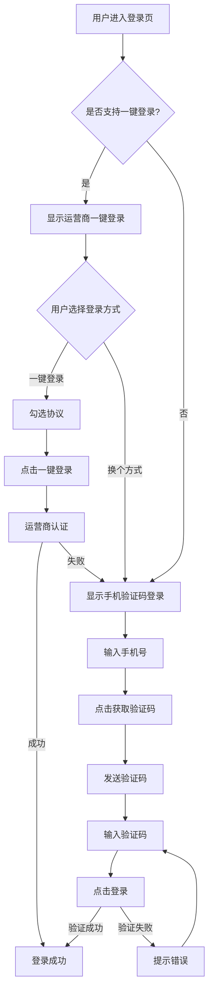
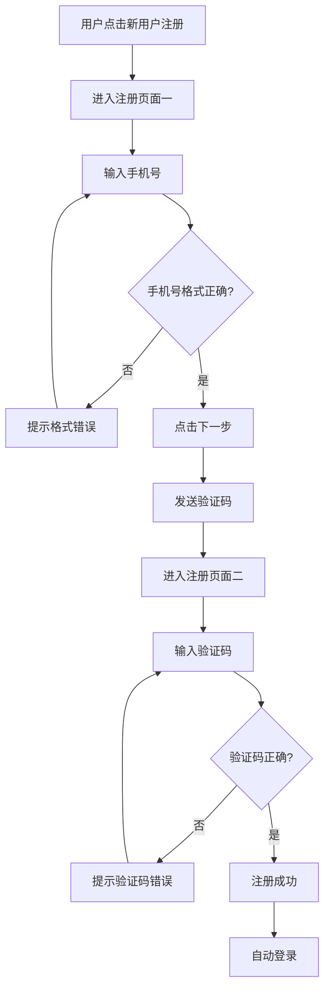

# PRD - 唯品会登录注册系统

## 文档信息

| 项目 | 内容 |
|------|------|
| **文档标题** | 唯品会登录注册系统产品需求文档 |
| **版本号** | v1.0 |
| **创建日期** | 2025-02-01 |
| **产品负责人** | 待填写 |
| **文档状态** | 草稿 |

---

## 修订历史

| 版本 | 修订日期 | 修订人 | 修订内容 |
|------|----------|--------|----------|
| v1.0 | 2025-02-01 | - | 初始版本创建 |

---

## 1. 项目背景

### 1.1 背景说明

唯品会作为领先的特卖电商平台，需要为用户提供安全、便捷、多样化的登录注册体验。当前登录注册流程是用户进入平台的第一道门槛，直接影响用户转化率和平台留存。

### 1.2 问题陈述

- 现有登录方式单一，无法满足不同用户群体的偏好
- 验证码登录流程体验有待优化
- 用户找回账号和密码流程不够清晰
- 移动端体验需要与年轻版设计系统保持一致

### 1.3 机会分析

- **市场需求**：用户期望快速、无摩擦的登录体验
- **技术机会**：运营商一键登录技术成熟，可大幅降低登录门槛
- **竞争态势**：主流电商平台已支持多种登录方式，需跟进优化

---

## 2. 产品概述

### 2.1 产品定位

为唯品会用户提供安全、便捷、多样化的移动端登录注册解决方案，覆盖主流登录场景，降低用户进入门槛。

### 2.2 核心价值

- **多样性**：支持手机验证码、账号密码、运营商一键登录、第三方登录等多种方式
- **便捷性**：运营商一键登录实现零操作登录
- **安全性**：验证码加密传输，协议明确规范
- **一致性**：严格遵循年轻版设计系统，保持品牌体验统一

### 2.3 适用场景

- 新用户注册唯品会账号
- 老用户登录唯品会账号
- 用户忘记密码或账号需要找回

---

## 3. 目标用户

### 3.1 用户画像

| 用户类型 | 特征描述 | 占比估算 |
|---------|----------|----------|
| **新用户** | 首次使用唯品会，年龄18-35岁，偏好快速注册 | 30% |
| **活跃用户** | 经常登录，偏好快捷登录方式 | 50% |
| **回流用户** | 曾使用但长时间未登录，可能忘记密码 | 15% |
| **问题用户** | 遇到登录问题需要帮助 | 5% |

### 3.2 用户痛点

- **注册繁琐**：传统注册流程长，需要填写多个字段
- **密码遗忘**：用户经常忘记密码，找回流程复杂
- **验证码延迟**：短信验证码接收慢或收不到
- **切换困难**：不同登录方式之间切换不够直观

### 3.3 用户期望

- **一键登录**：希望有最快捷的登录方式
- **多选择**：根据场景选择最合适的登录方式
- **流畅切换**：登录方式之间可以轻松切换
- **问题解决**：遇到问题能够快速找到解决方案

---

## 4. 产品目标

### 4.1 业务目标

| 指标 | 当前值 | 目标值 | 衡量周期 |
|------|--------|--------|----------|
| 登录成功率 | 待统计 | ≥95% | 上线后1个月 |
| 注册转化率 | 待统计 | ≥60% | 上线后1个月 |
| 平均登录时长 | 待统计 | ≤30秒 | 上线后1个月 |
| 运营商一键登录使用率 | - | ≥40% | 上线后3个月 |

### 4.2 用户目标

- 降低用户进入门槛，提升首次访问转化
- 减少登录流程中的用户流失
- 提供清晰的问题解决路径

### 4.3 成功指标（KPI）

- **核心指标**：登录成功率、注册转化率
- **用户体验指标**：平均登录时长、用户满意度评分
- **技术指标**：接口响应时间、验证码到达率

---

## 5. 功能需求

### 5.1 功能列表

| 功能模块 | 功能点 | 优先级 | 复杂度 | 说明 |
|---------|--------|--------|--------|------|
| **登录-手机验证码** | 页面一：手机号输入 | P0 | 中 | 默认登录方式，需校验手机号格式 |
| **登录-手机验证码** | 协议勾选 | P0 | 低 | 默认不勾选，登录前校验 |
| **登录-手机验证码** | 第三方登录入口 | P0 | 中 | 微信、QQ、Apple |
| **登录-手机验证码** | 其他登录方式入口 | P1 | 低 | 账号密码登录、新用户注册 |
| **登录-手机验证码** | 页面二：验证码输入 | P0 | 中 | 6位数字验证码 |
| **登录-运营商一键** | 一键登录按钮 | P0 | 高 | 显示本机号码，支持编辑跳转 |
| **登录-运营商一键** | 协议勾选 | P0 | 低 | 默认不勾选 |
| **登录-运营商一键** | 换个方式登录 | P1 | 低 | 返回默认登录方式 |
| **登录-账号密码** | 用户名/手机/邮箱输入 | P1 | 中 | 支持多种账号格式 |
| **登录-账号密码** | 密码输入（显示/隐藏） | P1 | 低 | 支持密码可见性切换 |
| **登录-账号密码** | 协议勾选 | P0 | 低 | 默认不勾选 |
| **登录-第三方** | 微信登录 | P0 | 中 | 调用微信授权 |
| **登录-第三方** | QQ登录 | P0 | 中 | 调用QQ授权 |
| **登录-第三方** | Apple登录 | P0 | 中 | 调用Apple授权 |
| **注册** | 页面一：手机号输入 | P0 | 中 | 需校验手机号格式 |
| **注册** | 页面一：跳转登录入口 | P1 | 低 | 已有账号用户快速跳转 |
| **注册** | 页面二：验证码输入 | P0 | 中 | 6位数字验证码 |
| **无法登录** | 底部浮层入口 | P0 | 低 | 页面右上角，唤起底部浮层 |
| **无法登录** | 忘记密码 | P1 | 中 | 密码找回流程 |
| **无法登录** | 找回账号 | P1 | 中 | 账号找回流程 |

---

### 5.2 功能详细说明

#### 5.2.1 手机验证码登录（默认）

**功能描述**：用户通过手机号和短信验证码进行登录，作为默认登录方式。

**使用场景**：
- 用户知道自己的手机号
- 用户不方便使用第三方登录
- 用户手机号未绑定第三方账号

**操作流程**：
1. 用户进入登录页，默认显示手机验证码登录页面一
2. 用户输入手机号（11位数字，校验格式）
3. 用户勾选用户协议（默认不勾选）
4. 用户点击"获取验证码"按钮（需先勾选协议）
5. 系统发送6位数字验证码至用户手机
6. 跳转至页面二，用户输入验证码
7. 验证通过后登录成功，跳转至首页

**交互说明**：
- 手机号输入框：实时校验格式（1开头，11位数字），格式正确时登录按钮高亮
- 协议勾选框：默认不勾选，未勾选时点击登录按钮提示勾选
- 第三方登录：显示微信、QQ、Apple图标，点击调用对应授权
- 其他登录方式：提供"账号密码登录"和"新用户注册"入口
- 无法登录：页面右上角显示"无法登录"，点击唤起底部浮层

**边界条件**：
- 手机号格式错误：显示错误提示，按钮置灰
- 手机号未注册：提示用户先注册
- 验证码错误：提示验证码错误，支持重新获取
- 验证码过期：提示验证码已过期，支持重新获取

**异常处理**：
- 短信发送失败：提示用户稍后重试
- 验证码发送过于频繁：提示用户XX秒后重试
- 网络异常：提示网络错误，请检查网络连接

---

#### 5.2.2 运营商手机号码一键登录

**功能描述**：通过运营商网络自动识别用户手机号，实现一键登录。

**使用场景**：
- 用户使用移动数据网络
- 用户希望最快速度登录
- 用户手机号支持运营商一键登录

**操作流程**：
1. 系统检测用户使用移动数据网络且支持一键登录
2. 显示运营商一键登录页面
3. 页面显示唯品会logo和本机号码
4. 用户勾选用户协议（默认不勾选）
5. 用户点击"一键登录"按钮
6. 系统调用运营商认证接口
7. 认证通过后登录成功，跳转至首页

**交互说明**：
- 本机号码显示：支持编辑，点击跳转到手机验证码登录
- 协议勾选框：默认不勾选，未勾选时点击登录按钮提示勾选
- 换个方式登录：点击返回手机验证码登录页面

**边界条件**：
- 不支持一键登录：不显示一键登录选项
- 一键登录失败：自动降级为手机验证码登录
- 手机号码识别错误：允许用户手动编辑

**异常处理**：
- 运营商接口超时：提示超时，提供其他登录方式
- 认证失败：提示认证失败，提供其他登录方式

---

#### 5.2.3 账号密码登录

**功能描述**：用户通过用户名/绑定手机/绑定邮箱和密码进行登录。

**使用场景**：
- 用户记住自己的账号密码
- 用户不方便接收短信验证码
- 用户习惯使用账号密码登录

**操作流程**：
1. 用户从默认登录页面选择"账号密码登录"
2. 显示账号密码登录页面
3. 用户输入用户名/绑定手机/绑定邮箱
4. 用户输入密码（支持显示或隐藏）
5. 用户勾选用户协议（默认不勾选）
6. 用户点击"登录"按钮
7. 验证通过后登录成功，跳转至首页

**交互说明**：
- 账号输入框：支持用户名、手机号、邮箱三种格式
- 密码输入框：默认脱敏显示，提供"眼睛"图标切换可见性
- 协议勾选框：默认不勾选，未勾选时点击登录按钮提示勾选

**边界条件**：
- 账号不存在：提示账号不存在
- 密码错误：提示密码错误，支持重新输入
- 账号或密码为空：提示请输入账号和密码

**异常处理**：
- 密码错误次数过多：锁定账号或要求验证码
- 网络异常：提示网络错误，请检查网络连接

---

#### 5.2.4 第三方账号登录

**功能描述**：用户通过微信、QQ、Apple ID等第三方账号快速登录。

**使用场景**：
- 用户已绑定第三方账号
- 用户希望快速登录
- 用户不愿意记忆密码

**操作流程**：
1. 用户在登录页面选择第三方登录方式
2. 点击对应图标（微信/QQ/Apple）
3. 跳转至第三方授权页面
4. 用户确认授权
5. 授权成功后登录成功，跳转至首页

**交互说明**：
- 显示第三方登录图标：微信、QQ、Apple
- 图标点击区域：图标+文字说明
- 未绑定情况：引导用户绑定手机号

**边界条件**：
- 用户未安装对应App：提示用户先安装
- 用户取消授权：返回登录页面
- 第三方账号未绑定唯品会账号：引导用户注册或绑定

**异常处理**：
- 第三方接口超时：提示超时，请重试
- 授权失败：提示授权失败，请重试

---

#### 5.2.5 注册流程

**功能描述**：新用户通过手机号和验证码完成注册。

**使用场景**：
- 用户首次使用唯品会
- 用户尚未注册唯品会账号

**操作流程**：
1. 用户从登录页面选择"新用户注册"
2. 显示注册页面一
3. 用户输入手机号（需校验格式）
4. 用户点击"下一步"按钮
5. 系统发送验证码至用户手机
6. 跳转至注册页面二
7. 用户输入验证码
8. 验证通过后注册成功，自动登录

**交互说明**：
- 手机号输入框：实时校验格式（1开头，11位数字）
- 下一步按钮：格式正确时高亮可点击
- 跳转登录入口：页面下方提供小入口，已有账号用户快速跳转

**边界条件**：
- 手机号已注册：提示手机号已注册，直接登录
- 手机号格式错误：显示错误提示，按钮置灰

**异常处理**：
- 短信发送失败：提示用户稍后重试
- 网络异常：提示网络错误，请检查网络连接

---

#### 5.2.6 无法登录（底部浮层）

**功能描述**：为遇到登录问题的用户提供帮助入口，通过底部浮层展示。

**使用场景**：
- 用户忘记密码
- 用户忘记账号
- 用户遇到其他登录问题

**操作流程**：
1. 用户在登录页面右上角点击"无法登录"
2. 唤起底部浮层
3. 浮层显示两个选项："忘记密码"和"找回账号"
4. 用户选择对应问题类型
5. 跳转至对应的解决流程页面

**交互说明**：
- 浮层位置：从底部向上滑出
- 浮层样式：严格按照年轻版设计系统对话框组件
- 选项展示：两个选项垂直排列，点击即跳转

**边界条件**：
- 用户点击浮层外部区域：关闭浮层
- 用户点击"取消"按钮：关闭浮层

**异常处理**：
- 跳转失败：提示页面加载失败，请重试

---

#### 5.2.7 登录方式切换

**功能描述**：支持用户在不同登录方式之间灵活切换。

**使用场景**：
- 用户发现当前登录方式不适用
- 用户想尝试其他登录方式

**操作流程**：
1. 用户在任意登录页面
2. 点击"换个登录方式"或对应入口
3. 跳转至目标登录方式页面
4. 用户继续登录流程

**交互说明**：
- **不使用Tab切换**：明确禁止使用Tab进行登录方式切换
- **使用页面跳转**：通过点击按钮跳转页面实现切换
- **保持状态**：切换过程中保持已输入信息（如手机号）

**边界条件**：
- 页面跳转动画：提供平滑的转场效果
- 返回导航：支持返回上一登录方式

---

## 6. 非功能性需求

### 6.1 性能要求

| 指标 | 要求 | 说明 |
|------|------|------|
| **页面加载时间** | ≤2秒 | 登录页面首次加载 |
| **验证码发送时间** | ≤3秒 | 从点击到发送成功 |
| **验证码到达率** | ≥98% | 短信成功发送比例 |
| **接口响应时间** | ≤500ms | 登录接口响应时间 |
| **一键登录响应时间** | ≤2秒 | 运营商认证响应时间 |

### 6.2 安全要求

- **数据传输**：所有登录请求必须使用HTTPS加密
- **密码存储**：使用BCrypt等加密算法存储密码
- **验证码有效期**：验证码有效期5分钟，过期自动失效
- **防暴力破解**：同一IP/设备5次失败后锁定30分钟
- **用户协议**：登录前必须同意用户协议和隐私政策

### 6.3 可用性要求

- **易用性**：登录流程不超过3步
- **容错性**：提供清晰的错误提示和解决方案
- **可访问性**：支持屏幕阅读器，提供语音提示（可选）

### 6.4 兼容性要求

| 设备类型 | 要求 |
|---------|------|
| **移动设备** | iOS 13+, Android 8+ |
| **浏览器** | Safari, Chrome, 微信内置浏览器 |
| **屏幕尺寸** | 375px - 428px（移动端标准宽度） |

### 6.5 可扩展性

- 预留第三方登录扩展接口（未来可能添加微博、抖音等）
- 预留生物识别登录接口（指纹、面部识别）
- 支持多语言扩展（未来可能支持英文版）

---

## 7. 用户故事

### 7.1 核心用户故事

| 故事ID | 用户故事 | 优先级 |
|--------|----------|--------|
| US-01 | 作为新用户，我想要快速注册账号，以便开始购物 | P0 |
| US-02 | 作为老用户，我想要一键登录，以便节省时间 | P0 |
| US-03 | 作为忘记密码的用户，我想要找回密码，以便重新登录 | P1 |
| US-04 | 作为第三方账号用户，我想要使用微信/QQ登录，以便不用记密码 | P0 |
| US-05 | 作为遇到问题的用户，我想要找到帮助入口，以便解决问题 | P1 |

---

## 8. 页面结构/信息架构

### 8.1 页面层级关系

```
登录注册系统
├── 1. 手机验证码登录（默认）
│   ├── 1.1 页面一：手机号输入
│   │   ├── 唯品会logo
│   │   ├── 手机号输入框
│   │   ├── 协议勾选框
│   │   ├── 登录按钮
│   │   ├── 第三方登录入口
│   │   ├── 其他登录方式入口
│   │   └── 无法登录入口
│   └── 1.2 页面二：验证码输入
│       ├── 返回按钮
│       ├── 验证码输入框
│       ├── 重新获取验证码
│       └── 登录按钮
│
├── 2. 运营商一键登录
│   ├── 唯品会logo
│   ├── 本机号码显示（可编辑）
│   ├── 协议勾选框
│   ├── 一键登录按钮
│   └── 换个方式登录
│
├── 3. 账号密码登录
│   ├── 账号输入框
│   ├── 密码输入框
│   ├── 密码可见性切换
│   ├── 协议勾选框
│   ├── 登录按钮
│   └── 返回按钮
│
├── 4. 注册流程
│   ├── 4.1 页面一：手机号输入
│   │   ├── 手机号输入框
│   │   ├── 下一步按钮
│   │   └── 跳转登录入口
│   └── 4.2 页面二：验证码输入
│       ├── 验证码输入框
│       └── 登录按钮
│
└── 5. 无法登录（底部浮层）
    ├── 忘记密码入口
    └── 找回账号入口
```

### 8.2 页面导航关系

```
┌─────────────────────────────────────────┐
│         手机验证码登录（默认）           │
│         ↓                               │
│    [第三方登录] → [第三方授权页面]       │
│         ↓                               │
│    [账号密码登录] → [账号密码登录页]     │
│         ↓                               │
│    [新用户注册] → [注册页面一]           │
│                   ↓                     │
│              [注册页面二]                │
│         ↓                               │
│    [运营商一键登录] → [一键登录页]       │
│         ↓                               │
│    [无法登录] → [底部浮层]               │
│                   ↓                     │
│         [忘记密码 / 找回账号]            │
└─────────────────────────────────────────┘
```

---

## 9. 业务流程

### 9.1 核心业务流程

#### 9.1.1 手机验证码登录流程



#### 9.1.2 注册流程



### 9.2 关键路径说明

**登录关键路径**：
1. 用户打开App → 显示运营商一键登录（支持）或手机验证码登录（默认）
2. 用户选择登录方式 → 输入账号信息
3. 用户勾选协议 → 点击登录
4. 系统验证 → 登录成功 → 跳转首页

**注册关键路径**：
1. 用户点击注册 → 输入手机号
2. 获取验证码 → 输入验证码
3. 验证通过 → 注册成功 → 自动登录

---

## 10. 原型说明

### 10.1 关键页面布局

#### 10.1.1 手机验证码登录页面一

**布局说明**：
- 顶部：唯品会logo（居中）
- 中部：手机号输入框（占满宽度）
- 中部：协议勾选框（左对齐）
- 中部：登录按钮（XL黑色按钮，占满宽度）
- 中部：第三方登录（水平排列微信、QQ、Apple图标）
- 底部：其他登录方式（账号密码登录、新用户注册）
- 右上角：无法登录入口

**交互逻辑**：
- 手机号输入：实时校验格式，格式正确时登录按钮高亮
- 协议勾选：默认不勾选，未勾选时点击登录提示勾选
- 第三方登录：点击图标调用对应授权
- 其他登录方式：点击文字跳转对应页面

#### 10.1.2 运营商一键登录页面

**布局说明**：
- 顶部：唯品会logo（居中）
- 中部：本机号码显示（可编辑）
- 中部：协议勾选框（左对齐）
- 中部：一键登录按钮（XL黑色按钮，占满宽度）
- 底部：换个方式登录

**交互逻辑**：
- 本机号码：点击可编辑，跳转至手机验证码登录
- 协议勾选：默认不勾选，未勾选时点击登录提示勾选
- 换个方式登录：点击返回手机验证码登录

#### 10.1.3 无法登录底部浮层

**布局说明**：
- 浮层从底部向上滑出
- 顶部：标题"选择问题类型"
- 中部：两个选项（忘记密码、找回账号）
- 底部：取消按钮

**交互逻辑**：
- 点击选项：跳转对应解决流程
- 点击取消或浮层外部：关闭浮层

### 10.2 交互规范

**严格按照年轻版设计系统实现**：
- 按钮：使用 `.yds-button` 组件，默认黑色
- 复选框：使用 `.yds-checkbox` 组件
- 对话框：使用 `.yds-dialog` 组件
- 提示框：使用 `.yds-toast` 组件，禁止使用 `alert()`
- 栅格：使用 `.yds-grid` 组件，12列均分
- 图标：从 `/Users/linyazhou/young-design-system/icons/` 加载
- 颜色：使用 `--yds-bg-*`, `--yds-text-*`, `--yds-border-*` 变量
- 移动端：最大宽度375px，禁止水平滚动

---

## 11. 技术要求

### 11.1 技术栈建议

**前端**：
- HTML5 + CSS3 + 原生JavaScript
- 严格遵循年轻版设计系统（YDS）
- 移动端适配（响应式设计）

**后端**：
- Java / Node.js / Go（根据现有技术栈）
- RESTful API设计
- JWT Token认证

**数据库**：
- MySQL / PostgreSQL（用户表、登录日志表）
- Redis（验证码存储、登录限制）

**第三方服务**：
- 短信服务：阿里云SMS / 腾讯云SMS
- 运营商一键登录：移动/联通/电信SDK
- 第三方登录：微信开放平台 / QQ互联 / Apple Sign in

### 11.2 系统架构

```
┌─────────────────────────────────────────┐
│          移动端（HTML5）                 │
│   严格遵循年轻版设计系统（YDS）          │
└─────────────────┬───────────────────────┘
                  │ HTTPS
┌─────────────────▼───────────────────────┐
│          API网关层                       │
│   - 请求路由                            │
│   - 负载均衡                            │
│   - 防攻击限流                          │
└─────────────────┬───────────────────────┘
                  │
┌─────────────────▼───────────────────────┐
│          业务逻辑层                      │
│   - 登录服务                            │
│   - 注册服务                            │
│   - 用户服务                            │
│   - 验证码服务                          │
└─────────────────┬───────────────────────┘
                  │
┌─────────────────▼───────────────────────┐
│          数据存储层                      │
│   - MySQL（用户数据）                   │
│   - Redis（验证码、限流）               │
└─────────────────────────────────────────┘
                  │
┌─────────────────▼───────────────────────┐
│          第三方服务                      │
│   - 短信服务                            │
│   - 运营商一键登录                      │
│   - 第三方登录（微信/QQ/Apple）         │
└─────────────────────────────────────────┘
```

### 11.3 接口需求

| 接口名称 | 请求方式 | 说明 |
|---------|----------|------|
| `/api/login/sms/send` | POST | 发送短信验证码 |
| `/api/login/sms/verify` | POST | 验证码登录 |
| `/api/login/password` | POST | 账号密码登录 |
| `/api/login/operator` | POST | 运营商一键登录 |
| `/api/register` | POST | 用户注册 |
| `/api/oauth/wechat` | POST | 微信登录 |
| `/api/oauth/qq` | POST | QQ登录 |
| `/api/oauth/apple` | POST | Apple登录 |

**示例接口**：发送短信验证码

```json
// 请求
POST /api/login/sms/send
{
  "phone": "13800138000",
  "type": "login" // login / register
}

// 响应
{
  "code": 200,
  "message": "验证码发送成功",
  "data": {
    "expire": 300 // 验证码有效期（秒）
  }
}
```

### 11.4 数据存储

**用户表（users）**：

| 字段名 | 类型 | 说明 |
|--------|------|------|
| id | BIGINT | 用户ID（主键） |
| phone | VARCHAR(20) | 手机号（唯一索引） |
| email | VARCHAR(100) | 邮箱 |
| username | VARCHAR(50) | 用户名 |
| password | VARCHAR(255) | 密码（加密） |
| wechat_openid | VARCHAR(100) | 微信OpenID |
| qq_openid | VARCHAR(100) | QQ OpenID |
| apple_user_id | VARCHAR(100) | Apple User ID |
| created_at | DATETIME | 创建时间 |
| updated_at | DATETIME | 更新时间 |

**登录日志表（login_logs）**：

| 字段名 | 类型 | 说明 |
|--------|------|------|
| id | BIGINT | 日志ID（主键） |
| user_id | BIGINT | 用户ID |
| login_type | VARCHAR(20) | 登录方式（sms/password/oauth） |
| ip | VARCHAR(50) | IP地址 |
| device | VARCHAR(100) | 设备信息 |
| status | TINYINT | 登录状态（0失败 1成功） |
| created_at | DATETIME | 登录时间 |

---

## 12. 开发计划

### 12.1 里程碑

| 阶段 | 时间节点 | 交付物 |
|------|----------|--------|
| **需求评审** | Week 1 | 需求文档评审通过 |
| **UI设计** | Week 2 | 高保真设计稿 |
| **前端开发** | Week 3-4 | 移动端HTML原型 |
| **后端开发** | Week 3-5 | API接口开发完成 |
| **联调测试** | Week 6 | 功能测试通过 |
| **上线发布** | Week 7 | 正式上线 |

### 12.2 版本规划

**v1.0（MVP版本）**：
- 手机验证码登录
- 账号密码登录
- 注册流程
- 无法登录（底部浮层）

**v1.1（迭代版本）**：
- 运营商一键登录
- 第三方登录（微信、QQ、Apple）
- 忘记密码/找回账号流程

**v1.2（优化版本）**：
- 生物识别登录（指纹、面部识别）
- 登录安全加固（设备指纹、风控）
- 多语言支持

### 12.3 资源需求

| 角色 | 人数 | 工作量 |
|------|------|--------|
| 产品经理 | 1 | 40小时 |
| UI设计师 | 1 | 80小时 |
| 前端开发 | 2 | 160小时 |
| 后端开发 | 2 | 160小时 |
| 测试工程师 | 1 | 80小时 |
| **总计** | **7人** | **520小时** |

---

## 13. 风险与限制

### 13.1 技术风险

| 风险 | 影响 | 应对措施 |
|------|------|----------|
| 运营商一键登录不稳定 | 高 | 提供降级方案，自动切换至验证码登录 |
| 短信到达率低 | 中 | 接入多家短信服务商，自动切换 |
| 第三方登录接口变更 | 中 | 封装第三方SDK，统一接口 |
| 验证码被刷 | 高 | 增加图形验证码、IP限流 |

### 13.2 业务风险

| 风险 | 影响 | 应对措施 |
|------|------|----------|
| 用户不习惯一键登录 | 低 | 提供多种登录方式，用户自选 |
| 注册流程复杂导致转化率低 | 高 | 简化注册流程，减少必填项 |
| 第三方登录隐私顾虑 | 中 | 明确隐私政策，用户自主选择 |

### 13.3 资源限制

- **时间限制**：7周开发周期较紧张，需严格控制需求变更
- **人力限制**：前后端开发资源有限，需优先保障核心功能
- **预算限制**：短信成本、运营商认证费用需控制

### 13.4 依赖项

- **第三方服务**：短信服务、运营商认证、第三方登录API稳定性
- **设计系统**：年轻版设计系统组件可用性
- **现有系统**：用户中心、账号体系接口支持

---

## 14. 运营与推广

### 14.1 推广策略

- **新用户引导**：首次登录时展示功能引导
- **老用户召回**：通过短信/Push推送引导用户使用一键登录
- **活动激励**：使用一键登录可获得积分奖励

### 14.2 运营计划

- **数据监控**：每日监控登录成功率、注册转化率
- **用户反馈**：收集用户登录问题，持续优化
- **A/B测试**：对比不同登录方式的使用率

### 14.3 数据监控

**核心指标**：
- 登录成功率（按登录方式分组）
- 注册转化率
- 平均登录时长
- 运营商一键登录使用率
- 第三方登录使用率
- 验证码到达率

**监控工具**：
- 埋点系统：用户行为分析
- 日志系统：登录错误分析
- 监控告警：接口异常告警

---

## 15. 附录

### 15.1 竞品分析

| 平台 | 登录方式 | 特点 | 借鉴点 |
|------|----------|------|--------|
| 淘宝 | 手机验证码、账号密码、淘宝账号、支付宝、第三方 | 登录方式多样，支持淘宝账号和支付宝互通 | 提供多种登录方式 |
| 京东 | 手机验证码、账号密码、微信、QQ | 支持微信、QQ登录，简化注册流程 | 第三方登录接入 |
| 拼多多 | 手机验证码、微信 | 极简登录，仅支持手机号和微信 | 简化登录流程 |

### 15.2 用户调研数据

**调研对象**：18-35岁唯品会用户
**调研方式**：问卷调查、用户访谈
**调研结论**：
- 60%用户偏好使用手机号+验证码登录
- 40%用户希望有一键登录功能
- 70%用户表示忘记过密码
- 50%用户使用过第三方登录

### 15.3 参考资料

- [年轻版设计系统文档](/Users/linyazhou/young-design-system/docs/design-standards.md)
- [年轻版设计系统 - 对话框组件](/Users/linyazhou/young-design-system/docs/dialog-guide.md)
- [年轻版设计系统 - 按钮演示](/Users/linyazhou/young-design-system/docs/button-demo.html)
- [年轻版设计系统 - 图标演示](/Users/linyazhou/young-design-system/docs/icons-demo.html)

### 15.4 术语表

| 术语 | 说明 |
|------|------|
| **YDS** | Young Design System，年轻版设计系统 |
| **运营商一键登录** | 通过移动运营商网络自动识别手机号并登录 |
| **第三方登录** | 使用微信、QQ、Apple等第三方账号登录 |
| **验证码登录** | 通过手机号+短信验证码登录 |
| **底部浮层** | 从底部向上滑出的弹出层，用于展示操作选项 |
| **协议勾选** | 用户协议和隐私政策的同意勾选框 |

---

## 文档结束

**下一步行动**：
1. 组织需求评审会议
2. 确认技术方案
3. 启动UI设计
4. 开始前端原型开发

**联系方式**：
- 产品负责人：待填写
- 技术负责人：待填写

---

**文档版本**：v1.0
**最后更新**：2025-02-01
